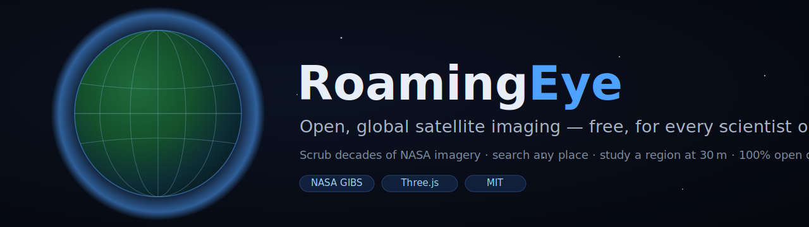
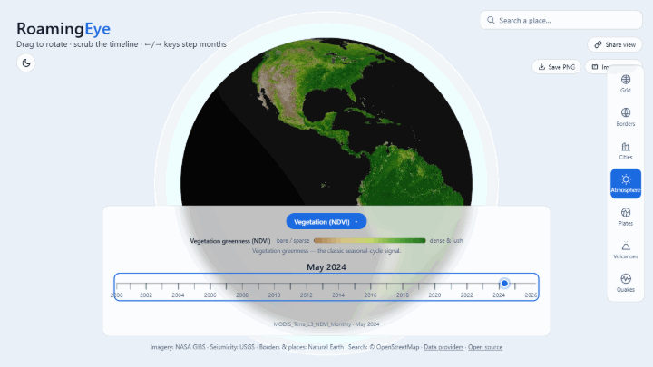

<p align="center">
  
</p>

<p align="center">
  <a href="https://github.com/zkWizard/RoamingEye/actions/workflows/ci.yml"></a>
  <a href="https://scorecard.dev/viewer/?uri=github.com/zkWizard/RoamingEye"></a>
  
  
  
  
</p>

# RoamingEye 🛰️🌍

**Roam a high-fidelity 3D Earth, scrub through decades of satellite imagery, and zoom into any region at 30-metre detail — all powered entirely by open data, free for anyone, anywhere.**

<p align="center"><strong>🌐 Live: <a href="https://zkwizard.github.io/RoamingEye/">zkwizard.github.io/RoamingEye</a></strong> — no account, no install, no fee.</p>

<p align="center">
  
  <br />
  <em>Two years of monthly vegetation composites, scrubbed live. Every month since 2000 is one keypress away.</em>
</p>

RoamingEye is an open-source research instrument for planetary-scale observation. It turns the public satellite archives that humanity has already paid for — NASA's MODIS and Harmonized Landsat-Sentinel collections — into a fast, intuitive, browser-based globe that any researcher, educator, journalist, or curious person can use without an account, a license, or a fee.

> **Our thesis:** the ability to _watch the Earth change over time_ should not be locked behind expensive commercial platforms. The data is open. The tooling should be too.

---

## 🔭 Why this matters

Decades of Earth observation sit in open archives, but most of it is reached through specialist GIS software, API keys, and data-wrangling pipelines that exclude all but a handful of trained users. RoamingEye is an attempt to collapse that barrier: **point, drag, and scrub** — and the planet's recorded history is in front of you.

**Statement of need.** Researchers, educators, and students need a way to _look at_ multi-decadal satellite records — to form hypotheses, check a site before pulling L3 granules, or teach a seasonal cycle — without a login, an SDK, or a GIS seat. Worldview is NASA-hosted and 2D; Google Earth Engine requires accounts and code. RoamingEye fills the gap in between: a zero-install, fully open-source, provenance-first 3D globe that runs in the browser, cites every dataset it renders, and exports reproducible, uncertainty-labelled time series.

It is built for, and by, the research community: every data source is open and cited, every imagery selection is provenance-tagged with the instrument and acquisition date, and the whole stack is MIT-licensed so any lab, classroom, or newsroom can fork and extend it.

---

## ✨ What it does

- 🌍 **A real 3D Earth** rendered with WebGL — grab to rotate, scroll to zoom from orbit down to the surface.
- 🔬 **Native-resolution tile streaming, on by default** — zoom in and the visible globe re-drapes itself with WMTS tiles chosen by screen-space error, up to each layer's native resolution (terrain reaches ~31 m), with parent-tile fallback so detail refines instead of popping.
- ⏳ **A temporal scrubber** — a ruler-style timeline that sweeps month-by-month through the last 5 years of monthly satellite composites, so you can _watch the seasons turn_ and trends emerge.
- 🌱❄️🌡️ **A rich set of scientific layers** — 9 open NASA products across **vegetation** (NDVI, EVI), **temperature** (land surface, 2 m air, sea surface), **water** (precipitation, soil moisture), **cryosphere** (snow cover), and **atmosphere** (aerosols) — grouped in a clean picker and growing.
- 📚 **An open-data Providers page** — a built-in catalogue of the ~33 agencies, archives, and platforms whose open data powers the project.
- 🧰 **A reviewed open-software finder** — browse Earth-science tools by domain, platform, and access path; every public recommendation links to its repository, documentation, SPDX evidence, and verification date.
- 🔎 **Search any place** — geocoded via OpenStreetMap; the globe traces the returned postcode, city, state, or country boundary and surfaces its latest month-over-month vegetation, rainfall, soil-moisture, and air-temperature signals.
- 📈 **A point time-series probe** — click anywhere on the globe and chart that layer's value at that point across its full record (26–46 years), with a provenance-stamped CSV download. Approximate by design (colormap inversion), honest about it everywhere.
- 🌋 **A plate-tectonics context pack** — Bird (2003) plate boundaries, ~1,200 Smithsonian GVP Holocene volcanoes colored by eruption recency, and live USGS seismicity (M4.5+, colored by depth) on one globe.
- 🧭 **A live coordinate readout** — hover anywhere to read latitude/longitude and the country/territory under the cursor.
- 🗺️ **Toggleable overlays** — coordinate grid, national borders, cities, and an atmosphere glow.

---

## 🧪 Built for research

RoamingEye is designed around real scientific workflows — see
[**docs/research-recipes.md**](docs/research-recipes.md) for five step-by-step
walkthroughs (drought signals, LST trends, the plate-tectonics lecture view,
snowpack tracking, deforestation figures). For **how the tool computes what it
shows and where it stops being trustworthy** — the probe pipeline, area
weighting, uncertainty, the seasonal Mann-Kendall / Sen's slope trend test, and
the measured per-layer inversion accuracy — read [**METHODS.md**](METHODS.md).
A few examples it already supports:

| Field                               | What you can observe                                                       |
| ----------------------------------- | -------------------------------------------------------------------------- |
| **Vegetation phenology**            | Green-up and senescence cycles via monthly NDVI/EVI across years.          |
| **Deforestation & land-use change** | Step a 30 m study patch over a forest frontier across consecutive years.   |
| **Urban expansion**                 | Watch a city's footprint grow in high-resolution true colour.              |
| **Drought & agriculture**           | Compare vegetation vigour between wet and dry years over a region.         |
| **Snow & cryosphere**               | Track seasonal snow advance/retreat with monthly snow-cover composites.    |
| **Disaster & event assessment**     | Pull the clearest pre/post imagery for a study area after a fire or flood. |
| **Point time series**               | Click a site → 26-year chart + CSV for drought, greening, or LST trends.   |
| **Plate tectonics & geohazards**    | Plate boundaries + Holocene volcanoes + live seismicity on the terrain.    |

Every high-resolution scene is labelled with its **instrument and acquisition date** (e.g. _Sentinel-2 · HLS S30 · 30 m · 2024-08-05_) so observations are reproducible and citable.

---

## 🛰️ Data & provenance

100% open, public-domain or open-licensed data:

| Source                        | Product                                             | Native resolution | Coverage            | License       |
| ----------------------------- | --------------------------------------------------- | ----------------- | ------------------- | ------------- |
| **NASA GIBS** (MODIS/Terra)   | Monthly vegetation (NDVI, EVI)                      | 1 km              | 2000 → present      | Public domain |
| **NASA GIBS** (MODIS/Terra)   | Monthly snow cover                                  | 2 km              | 2000 → present      | Public domain |
| **NASA GIBS** (HLS)           | High-res true colour (Sentinel-2 S30 / Landsat L30) | ~30 m             | 2013/2015 → present | Public domain |
| **Natural Earth**             | National borders, populated places                  | 1:110m            | —                   | Public domain |
| **OpenStreetMap** (Nominatim) | Geocoding & administrative boundaries               | —                 | —                   | ODbL          |

See [`DATA_SOURCES.md`](DATA_SOURCES.md) for the full catalogue, layer identifiers, and scientific notes.

> **An honest note on resolution.** Open data tops out at roughly **10 m** (Sentinel-2) to **30 m** (Landsat/HLS) for recent, frequently-revisited imagery. True sub-metre "street-level" imagery only exists in commercial archives, which are neither free nor global. RoamingEye deliberately stays within the open ecosystem — and its [tiled-streaming engine](docs/rfcs/RFC-001-tiled-imagery-streaming.md) renders each layer's full native resolution wherever you zoom, by default.

---

## 🚀 Quickstart

**Requirements:** [Node.js](https://nodejs.org/) 20.19+ (or 22.12+) and npm.

```bash
git clone https://github.com/zkWizard/RoamingEye.git
cd RoamingEye
npm install
npm run dev          # → http://localhost:5173
```

The dev server is also exposed on your local network, so you can open the printed `http://<your-ip>:5173` address on a phone or tablet.

```bash
npm run build        # type-check + production build
npm run test         # unit tests (Vitest)
npm run test:e2e     # browser smoke + feature tests (Playwright)
```

---

## 🏗️ How it works

A lightweight, dependency-honest stack — no heavy GIS frameworks:

- **[Three.js](https://threejs.org/)** for WebGL rendering, on a single textured globe.
- **NASA GIBS WMS** for imagery, streamed straight into GPU textures (the service is CORS-open, so there's no backend).
- Pure, unit-tested logic for the geodesy, timeline, scene selection, and geocoding; rendering and DOM kept separate from it.
- **TypeScript**, **Vite**, **Vitest**, **Playwright**, **ESLint/Prettier**, and **GitHub Actions** CI.

For a contributor's tour of the codebase, see [`ARCHITECTURE.md`](ARCHITECTURE.md).

---

## 🤝 Contributing

**We are actively looking for collaborators** — Earth scientists, remote-sensing specialists, graphics engineers, designers, and data wranglers all have a place here.

- 🗣️ **Used RoamingEye in your research or teaching? [Give feedback](https://github.com/zkWizard/RoamingEye/issues/new?template=feedback.yml)** — three questions, two minutes, rough notes welcome. Open to a 15-minute chat about your workflow? Say so in the form; what researchers tell us directly shapes the [roadmap](ROADMAP.md).
- 📘 Read [`.github/CONTRIBUTING.md`](.github/CONTRIBUTING.md) — setup, workflow, and the (one-line, no-CLA) DCO sign-off.
- 🏛️ [`GOVERNANCE.md`](GOVERNANCE.md) explains the trust ladder and how decisions get made.
- 🌱 New to the project? Browse [**good first issues**](https://github.com/zkWizard/RoamingEye/labels/good%20first%20issue).
- ➕ Want to add a dataset? [`docs/adding-a-data-layer.md`](docs/adding-a-data-layer.md) walks through it.
- 🧰 Want to improve the software finder? [`docs/agent-fleet.md`](docs/agent-fleet.md) explains the six review-gated catalog agents, Fleet status view, and editorial approval flow.
- 🚩 **The flagship engine:** [**RFC-001 — Tiled imagery streaming**](docs/rfcs/RFC-001-tiled-imagery-streaming.md) shipped — and its follow-ons (tile-edge skirts, polar handling, Sentinel-2 at 10 m) are great graphics projects. See the [roadmap](ROADMAP.md).

Every change lands through a reviewed, CI-gated pull request. Be kind — see the [Code of Conduct](.github/CODE_OF_CONDUCT.md).

---

## 🗺️ Roadmap

### 🎯 Goals — 2026

_Last updated: **2026-07-11**._ Tracked daily as work lands; full detail and
the feature-level Now / Next / Later live in [`ROADMAP.md`](ROADMAP.md).

- [ ] 🚩 **Accurate absolute probe values** ([#170](https://github.com/zkWizard/RoamingEye/issues/170)) — invert against GIBS's real colormaps so the probe is citable for absolute measurements, not just trends.
- [ ] **Research partnerships** — working contact with ≥2 PhD-level remote-sensing / Earth-observation groups steering build direction.
- [ ] **NASA engagement** — contact the GIBS / ESDIS / Worldview teams; validate our inversion approach and pursue an ecosystem listing.
- [ ] **Citable software** — v1.1.0 GitHub release → Zenodo DOI → JOSS paper _(in progress: release notes drafted, `CITATION.cff` shipped)_.
- [ ] **Teaching adoption** — used in ≥3 university courses or classrooms, with instructor feedback folded back in.
- [ ] **Grow the layer catalogue** — fire/thermal anomalies and surface water.
- [ ] **Sentinel-2 at 10 m** — direct integration for the study patch.
- [ ] **A real contributor community** — ≥5 merged PRs from external contributors.
- [ ] **Verified on real devices** — hands-on phone/tablet pass.

### Now / Next / Later at a glance

- **Now** — 🚩 absolute probe accuracy (#170), release & DOI residuals, research/NASA outreach.
- **Next** — more scientific layers (fire/thermal, surface water), tile-edge polish for HD streaming, Sentinel-2 at 10 m.
- **Later** — true 3D elevation terrain (GEBCO/SRTM), change-point detection & region comparison, annotation & collaboration, offline field mode.

---

## 🎓 Citing RoamingEye and its data

Work made with RoamingEye involves **three citable objects** — the tool, the
imagery service, and the datasets. Doing all three right takes two minutes:

**1. The tool.** The repository ships a [`CITATION.cff`](CITATION.cff) that
GitHub renders as a ready-made citation (**"Cite this repository"** in the
sidebar, APA and BibTeX). When citing a **specific observation**, include the
**view URL** from the address bar — it encodes the layer, month, and camera
position, so readers reproduce exactly what you saw — and the acquisition
details shown in the app (e.g. the study-region chip's
`Sentinel-2 · HLS S30 · 30 m · 2026-05-11`). CSV exports already carry all of
this in their `#` provenance headers, including `# view_url` and
`# tool_version`.

**2. The imagery service.** NASA asks users of GIBS to include this
acknowledgment verbatim:

> We acknowledge the use of imagery provided by services from NASA's Global
> Imagery Browse Services (GIBS), part of NASA's Earth Science Data and
> Information System (ESDIS).

**3. The data.** GIBS renders _datasets_ that carry their own DOIs and
citations — [NASA's data-use guidance](https://www.earthdata.nasa.gov/engage/open-data-services-software-policies/data-use-guidance)
asks publications to cite them directly (each DOI resolves to a landing page
with the full citation; CSV exports name theirs in `# data_product` /
`# data_doi`):

| Layer(s)                     | Dataset                                       | DOI                                                                    |
| ---------------------------- | --------------------------------------------- | ---------------------------------------------------------------------- |
| Vegetation (NDVI, EVI)       | MOD13A3 v061                                  | [10.5067/MODIS/MOD13A3.061](https://doi.org/10.5067/MODIS/MOD13A3.061) |
| Land surface temp            | MOD11C3 v061                                  | [10.5067/MODIS/MOD11C3.061](https://doi.org/10.5067/MODIS/MOD11C3.061) |
| Air temperature (2 m)        | MERRA-2 M2TMNXSLV v5.12.4                     | [10.5067/AP1B0BA5PD2K](https://doi.org/10.5067/AP1B0BA5PD2K)           |
| Sea surface temp             | MODIS Aqua L3 SST Thermal Monthly 9km v2019.0 | [10.5067/MODSA-MO9D9](https://doi.org/10.5067/MODSA-MO9D9)             |
| Precipitation, soil moisture | GLDAS_NOAH025_M v2.1                          | [10.5067/SXAVCZFAQLNO](https://doi.org/10.5067/SXAVCZFAQLNO)           |
| Snow cover                   | MOD10CM v61                                   | [10.5067/MODIS/MOD10CM.061](https://doi.org/10.5067/MODIS/MOD10CM.061) |
| Aerosols (AOD)               | MERRA-2 M2TMNXAER v5.12.4                     | [10.5067/FH9A0MLJPC7N](https://doi.org/10.5067/FH9A0MLJPC7N)           |
| Land cover (IGBP)            | MCD12Q1 v061                                  | [10.5067/MODIS/MCD12Q1.061](https://doi.org/10.5067/MODIS/MCD12Q1.061) |
| Terrain (shaded relief)      | ASTGTM v003                                   | [10.5067/ASTER/ASTGTM.003](https://doi.org/10.5067/ASTER/ASTGTM.003)   |
| High-res study patch         | HLSS30 v2.0                                   | [10.5067/HLS/HLSS30.002](https://doi.org/10.5067/HLS/HLSS30.002)       |

This table is generated from the same layer configuration the app runs on and
is drift-guarded by a unit test — if a layer's source product changes, CI
fails until the docs follow. The in-app **Data providers** page (footer link)
shows the same list.

> A Zenodo DOI (for stable, versioned citations) is planned — maintainers: mint
> one by connecting the repo at [zenodo.org](https://zenodo.org/account/settings/github/)
> and cutting a release; the DOI badge then goes here.

## 📄 License & attribution

- **Code:** [MIT](LICENSE).
- **Imagery & data:** retain their own licenses (see the table above). Imagery courtesy of **NASA EOSDIS GIBS**; vector data **© Natural Earth**; geocoding **© OpenStreetMap contributors**.

## 🙏 Acknowledgements

RoamingEye stands entirely on the shoulders of the open Earth-observation community — the scientists and engineers at **NASA**, **ESA**, **USGS**, the **OpenStreetMap** project, and **Natural Earth**, who put planetary-scale data in the public domain. This project is simply a friendlier window onto their work.

<p align="center"><em>Built in the open, for the planet. ⭐ Star the repo to follow along.</em></p>
